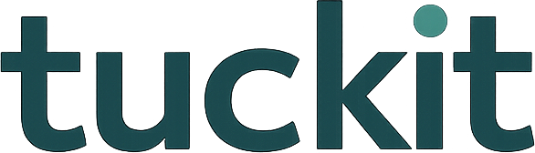
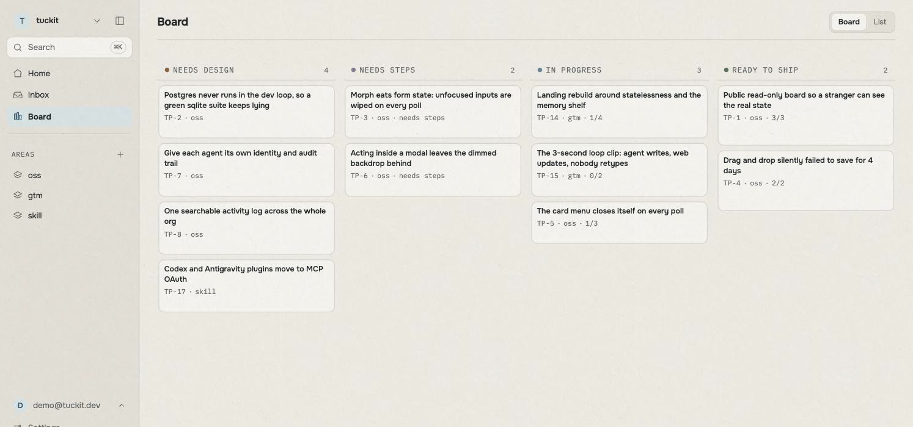

<p align="center">
  <picture>
    <source media="(prefers-color-scheme: dark)" srcset="tuckit/web/static/web/brand/wordmark-dark.png">
    
  </picture>
</p>

<p align="center">
  <strong>One project state, shared by humans and coding agents.</strong><br>
  A board you read in a browser and your agent reads over MCP. One database, no sync step.
</p>

<p align="center">
  <a href="https://tuckit.dev">Website</a> &middot;
  <a href="https://docs.tuckit.dev">Docs</a> &middot;
  <a href="https://app.tuckit.dev">Hosted</a> &middot;
  <a href="https://github.com/tuck-it/tuckit-plugins">Agent plugins</a> &middot;
  <a href="LICENSE">BSL 1.1</a>
</p>

---

## The problem

Your coding agent finishes a session knowing things nobody else does. What it
decided, what it discovered on the way, what it deliberately left for later.
All of that lives in a transcript. The next session starts blank, so you brief
it again, and you find out what actually happened by reading chat logs.

Agent memory does not fix this, because it is memory for the agent. You still
cannot see it, and neither can the next agent, or your teammate.

## What tuckit is

A project board that both sides read and write. You open it in a browser. Your
agent reaches the same workspace over MCP. There is one database and no sync
step, so whichever side you look at is current.



The model is small on purpose, so an agent has little room to get it wrong:

- An **Area** is a long-lived responsibility, such as backend or billing.
- A **Slice** is the one unit of work. It carries its spec (what we are building
  and why), its constraints (what a later agent must not get wrong), and a
  checklist. A slice with no area yet is sitting in the Inbox.
- A **Bite** is one step on that checklist.

There is no ticket and no separate plan object. A slice's **stage** is derived
from its own content rather than set by hand, so it cannot drift from reality:
an empty spec reads as `needs_design`, a spec with no steps as `needs_steps`,
then `executing`, then `ready_to_ship`. The only thing a human decides outright
is **status**, which is `open`, `shipped` or `dropped`.

## What it looks like in use


The agent reads the project before it does anything, tells you where things
stand, does the work, files what it discovered along the way, and hands back the
decision that was never its to make.

That loop is worth having because:

- **You stop re-briefing.** The agent opens a session by reading live project
  state instead of inferring it from `git log`.
- **Discoveries stop dying in the transcript.** The thing an agent noticed while
  fixing something else becomes a slice in the Inbox, not a line in a scrollback
  nobody reopens.
- **Losing context stops losing your place.** Progress lives on the server, so
  an agent that gets compacted mid-slice reads the board and resumes.
- **You can review without reading chat logs.** What was done, what was decided,
  and what is waiting on you are all on a screen.
- **Agents stop disagreeing about the state.** Several agents, several machines,
  one workspace.

## Connect your agent

tuckit serves the web dashboard and the agent MCP endpoint from the same ASGI
app. Any MCP-capable agent can connect. On the hosted app the endpoint needs no
token to paste, because it speaks OAuth 2.1:

```bash
claude mcp add --transport http tuckit https://app.tuckit.dev/mcp
```

For a fuller setup, including Codex and Antigravity, see
[docs.tuckit.dev/connect-your-agent](https://docs.tuckit.dev/connect-your-agent/).

To go further than a raw MCP connection, [**tuckit-plugins**](https://github.com/tuck-it/tuckit-plugins)
(MIT) adds session hooks and a set of workflow skills that carry one slice from
idea to shipped, writing each artifact onto the board rather than into a
markdown file the next session will never find.

## Run it yourself

Verified end to end against a clean clone. Requires Python 3.11 or newer.

```bash
git clone https://github.com/tuck-it/tuckit.git
cd tuckit
uv sync                     # or: python -m venv .venv && pip install -e .

cp .env.example .env        # DATABASE_URL defaults to a local sqlite file

uv run python manage.py migrate
uv run python manage.py create_account \
  --email you@example.com --org "My Org" --slug my-org
```

`create_account` prompts for a password, or reads one from an env var you name
with `--password-env`.

Then start the server. **The server entry points do not read `.env`**, so export
it first:

```bash
set -a; . ./.env; set +a
uv run uvicorn tuckit.asgi:app --port 8000
```

Open <http://localhost:8000/> and log in with the account you just made.

<details>
<summary>Things that will otherwise cost you an hour</summary>

- **`DATABASE_URL` is required**, with no fallback. It is in `.env.example`, so
  copying that file is enough, but a hand-written `.env` that omits it fails at
  startup with `ImproperlyConfigured`.
- **Only `manage.py` loads `.env`.** `tuckit/asgi.py` and `tuckit/wsgi.py` never
  call `load_dotenv()`, so `uvicorn` and `gunicorn` see an empty environment
  unless you export the variables yourself. This is why the `set -a` line above
  is not decoration.
- **Use `tuckit.asgi:app` to serve agents.** `manage.py runserver` and the WSGI
  entry point serve the web dashboard only, so the MCP endpoint will not be
  there.
- **Signup is closed by default.** `TUCKIT_REGISTRATION_OPEN` defaults to false,
  which is why `create_account` is the account path rather than the register
  page. Set it to `1` to open self-service signup.
- **`manage.py bootstrap` is not the way in.** It creates a passwordless user
  and a legacy API token for scripted local use. Nobody can log in as it.
- **sqlite is for a first look.** Production runs Postgres, and a green sqlite
  test run has hidden Postgres-only bugs here before. Point `DATABASE_URL` at
  Postgres for anything you intend to trust.

</details>

Slack integration is optional and off until you set `SLACK_CLIENT_ID`,
`SLACK_CLIENT_SECRET` and `SLACK_SIGNING_SECRET`; `ANTHROPIC_API_KEY` is a
separate, also-optional switch on top of that, needed only for @mention
handling.

Configuration beyond this, including the full environment variable list, is on
[docs.tuckit.dev](https://docs.tuckit.dev).

## Tests

```bash
uv run pytest
```

`uv sync` installs the test dependencies; `pip install -e .` does not, since
they live in a dependency group. On the pip path, add them first:

```bash
pip install pytest pytest-django pytest-asyncio django-test-migrations
```

## License

**Business Source License 1.1.** Source-available, not OSI open source.

You may read the code, modify it, and run it in production, including
self-hosting it for your own organisation. The one thing it withholds is
offering tuckit to third parties as a hosted or managed service. On 2030-07-10
it converts to Apache License 2.0. See [LICENSE](LICENSE) for the terms that
actually bind.

The agent plugins in [tuckit-plugins](https://github.com/tuck-it/tuckit-plugins)
are MIT, deliberately, so they can be vendored into any agent toolchain.
